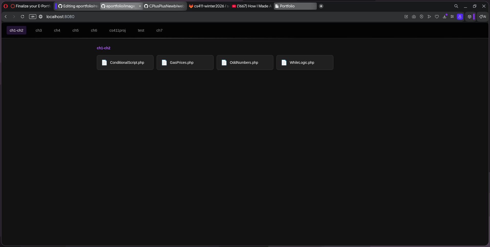
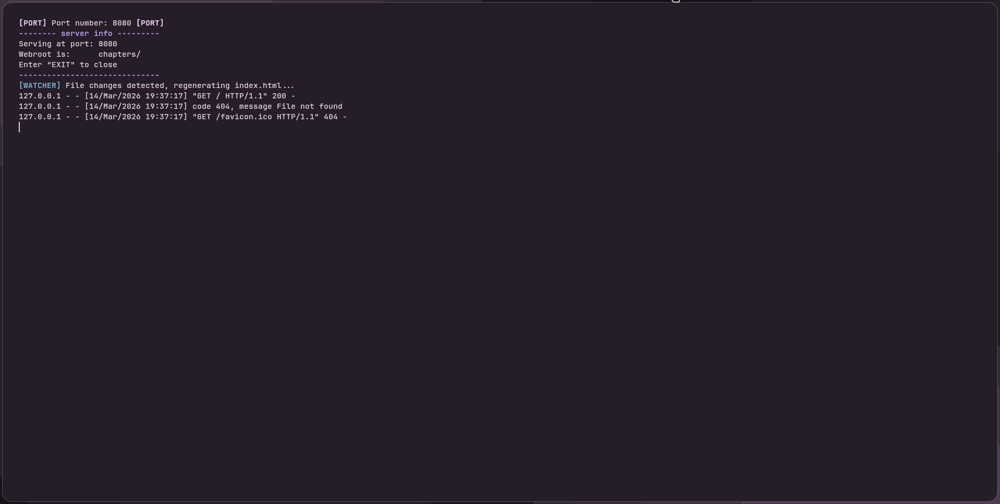

# Preston's E-Portfolio
**BAS Information Technology | Computer Science**

This portfolio presents my academic work and hands-on projects demonstrating competency across software development, web technologies, and IT management.

---

## Projects

### 1.Front-End Programming — Local File Manager
**Tech:** HTML, CSS, JavaScript, Python, PHP  
**Repo:** [websitemaker python](https://github.com/CPlusPlusNewb/websitemaker_python )

A browser-based file manager served over a local Python HTTP server. The interface allows users to browse, and view files through a clean web UI without needing a dedicated hosting environment. The index changes when the user refreshes the page and if the code has actually changed on the "back-end".

**How it benefited me:** This project taught me how to bridge a Python backend with a PHP-assisted front-end, and how to serve dynamic content locally without a full web stack. It deepened my understanding of how servers handle file I/O and client requests.  

---

### 2. Back-End Programming — Python Auto-Web-Host *(Personal Project)*
**Tech:** Python  
**Repo:** [websitemaker python](https://github.com/CPlusPlusNewb/websitemaker_python )

A Python script that, when run in any directory without an existing `index.html`, automatically generates `index.html`, `style.css`, and `scripts.js` -- creating a ready-to-serve static site from scratch. No templates, no frameworks, no manual setup.

**How it benefited me:** Writing a generator that produces valid, this pushed me to deeply understand how HTML/CSS/JS are structured.

**Security notes:** Exception handling is used to avoid overwriting existing files, preventing accidental data loss.  

---

### 3. Web Development — Social Media Messageboard *(Scrum Team Project)*
**Tech:** HTML, CSS, JavaScript, flat-file database  
**Repo:** [cs411-winter2026/socialmedia-messageboard](https://gitlab.com/cs411-winter2026/socialmedia-messageboard)

A social media-style messageboard built as a Scrum team project. My contributions included authoring `style.css`, laying out the project file structure on GitLab, and building the **feed function** -- the core feature that reads from the database file and dynamically renders posts to the page.

**How it benefited me:** Working on a scrum project has showed me how to collaberate as a team. And it has shown me that I can count on others to other parts of a project without having to worry too much about their task which is contrary to past projects.

**Scrum reflections:** Our team used short Sprints to iterate on the UI and backend separately. Successes included clear task ownership and regular stand-ups. Challenges included merge conflicts from parallel work on shared files and overshooting for the given timeline. 

---

## Program Outcomes

Through these projects I have developed competencies in:
- Front-end design and dynamic web interfaces
- Server-side scripting and local hosting
- Agile/Scrum team collaboration
- File I/O, data rendering, and basic security practices

---

*Last updated: March 2026*
